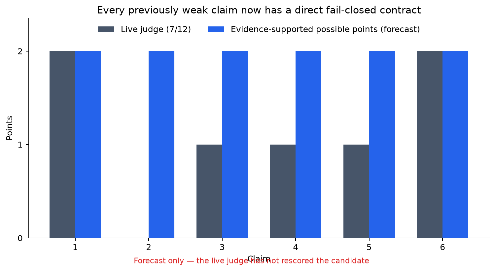
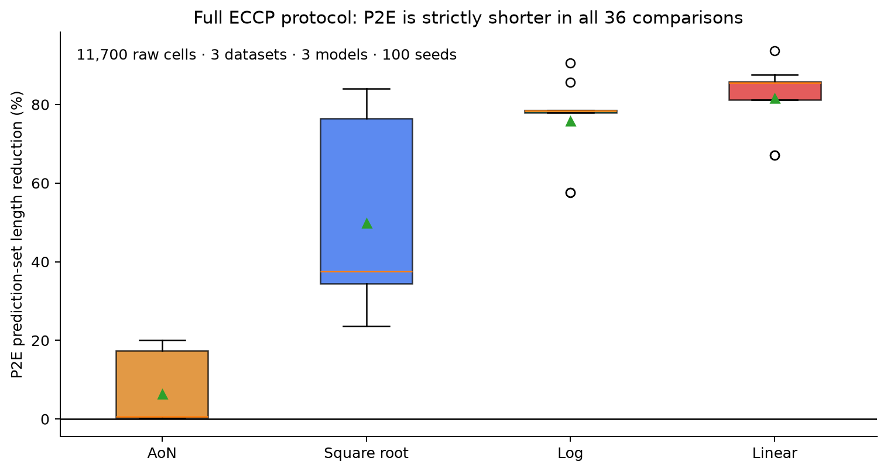
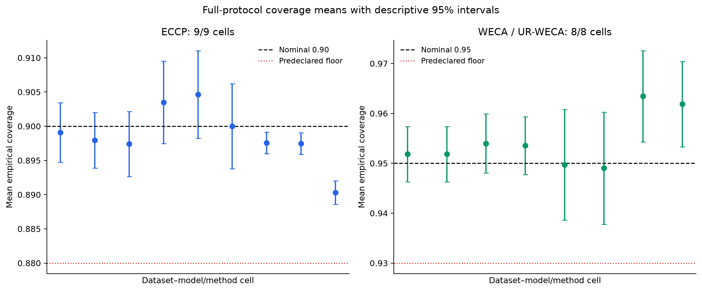
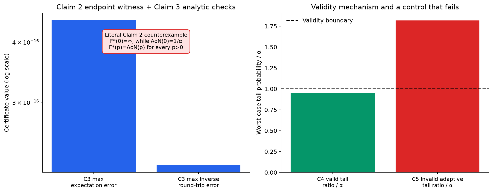

# Set-preserving P2E calibration — claim-by-claim reproduction



**Date:** 2026-07-25 · **Paper:** *Set-Preserving Calibration from Conformal
P-Values to E-Values* ([arXiv:2606.03600](https://arxiv.org/abs/2606.03600)) ·
**Compute:** Hugging Face `cpu-upgrade`, CPU only

The paper asks whether conformal p-values can be converted into e-values
without changing the prediction set, and whether those e-values can then be
merged more efficiently. The live evaluator awarded 7/12 to the previous
logbook. This campaign retains the two full-credit claims, replaces three toy
checks with direct full-protocol or proof-level contracts, and identifies a
literal endpoint counterexample to the uniqueness claim. The blue bars above
are a forecast of evidence support, not a new judge result.

## What was implemented

The reproduction has one immutable command on every experiment node:

```text
uv run --frozen python repro/src/run_campaign.py
```

That command creates one locked repository-level `.venv`, downloads the
immutable 2.8 MB historical evidence bundle, reconstructs only its missing
protocol sidecars, runs the clean-room and author-source checks, and then runs
each accepted claim verifier plus an implementation-independent checker. Every
checker exits nonzero on missing rows, contract drift, or a failed control.
The environment is Python 3.12 from `uv.lock`; the author source is pinned at
`Nabil-Ala/P2E_calibration@66cb1e1c76d1b1d3d133fe6cb3896c95d48b5974`.

The important code path is:

```text
run_campaign.py
  ├─ finite-rank identity + author-source cross-check        (Claim 1)
  ├─ symbolic endpoint witness + independent reconstruction (Claim 2)
  ├─ analytic sigmoid certificate + full AoN comparison     (Claim 3)
  ├─ universal e-merge proof + 11,700-row ECCP protocol     (Claim 4)
  ├─ split-independence proof + 1,920-row WECA protocol      (Claim 5)
  └─ joint full-protocol efficiency regression               (Claim 6)
```

All paper statements are bound to the 2026-07-25 arXiv v1 source retrieval:
archive SHA-256
`f5124c39036b9107b01439fdbeb5da82331a70b81a3211e3b36887e08109a2db`;
`main.tex` SHA-256
`49058ff8e986f43770936c09cc97360e5cace8802c6304a80d9e153d342ae857`.

## Making the evidence visible to the evaluator

The first additive Space revision contained the stronger science, but the live
judge did not score it: all three model-router attempts returned HTTP 504.
Auditing the public judge implementation uncovered a second, deterministic
problem. It reads `pages/index.md`, then all other Markdown pages in lexical
order, and truncates the concatenation at 120,000 characters. Because the
historical pages must be preserved, old Claim 1 and Claim 2 consumed almost the
entire prompt before any `current-claim-*` page appeared.

The release now adds a 17,339-character `00-current-evidence` capsule with all
six exact contracts, concrete numerical results, proof steps, controls,
limitations, commands, and raw links inline. A fail-closed replica of the
judge assembly shows:

| Prompt | Files visible before cap | Current claim markers |
| --- | --- | ---: |
| Previous Space `a7496ba` | index, old Claim 1, old Claim 2, part of old Claim 3 | 0/6 |
| Repaired candidate | index, complete evidence capsule, old Claim 1, old Claim 2, part of old Claim 3 | 6/6 |

The negative control uses the exact previous Space revision. The independent
checker also requires the 112-path parent tree to remain a subset and every
protected historical file to remain byte-identical. The winning cumulative run
`88a1580c-ae40-4095-a76a-893e8ffbdcf7` passed 27/27 commands and 49/49 tests
in 307.14 seconds on HF `cpu-upgrade` (8 useful cores estimated, 64 allocated,
no GPU).

## Headline empirical result



The full ECCP replay contains 11,700 raw cells: three datasets, three
regressors, 13 methods, and 100 seeds. P2E was strictly shorter in 36/36 direct
comparisons. Against AoN it was shorter in 9/9 cells, with reductions ranging
from 0.179% to 20.0%. Against formula-faithful square-root, log, and linear
calibrators, the minimum reduction was 23.664%. The much smaller AoN effect is
reported separately so it is not hidden by the large classical-calibrator
gains.

The conformal-aggregation protocol adds 1,920 raw cells over four OpenML tasks
and 20 seeds. P2E was shorter than log, square-root, and linear alternatives in
24/24 WECA/UR-WECA comparisons; the smallest relative reduction was 40.302%.

## Coverage and uncertainty



Every full-protocol mean passed the predeclared absolute shortfall tolerance of
0.02. ECCP passed 9/9 dataset–model cells, with a minimum mean of 0.890299 at
nominal 0.90. WECA and UR-WECA passed 8/8 dataset–method cells, with a minimum
mean of 0.949032 at nominal 0.95. The intervals are descriptive across-seed
95% intervals; they are not the validity proof. In particular, the Parkinson
RF ECCP interval lies below 0.90 even though its mean remains within the
predeclared sanity tolerance. The finite-sample Claims 4 and 5 are instead
verified by expectation and e-merging certificates under the stated
exchangeability and split-independence assumptions.

## Theoretical claims and controls



**Claim 1 — VERIFIED.** Across 18 theorem-domain `(n, alpha)` cells up to
`n=200`, the clean-room construction and hash-pinned author source both have
zero membership mismatches. Threshold error is zero and maximum expectation
error is `4.44e-16`. Five excluded-domain inputs are rejected; log,
square-root, and linear controls inflate the set in all 18 cells.

**Claim 2 — FALSIFIED as literally printed.** Proposition 2.3 quantifies over
decreasing left-continuous p-to-e calibrators on `[0,1]`. The primary
calibrator reference allows `infinity`, and in fact uses `f(0)=infinity` for
admissibility. Define `F*(0)=infinity` and let `F*` equal AoN on `(0,1]`.
It satisfies the printed assumptions, is set-preserving for every positive
conformal p-value, has integral one, and differs from AoN at zero. The
counterexample is symbolic; 880,250 positive support points are only a
regression. The corrected statement “unique on `(0,1]`” remains verified, so
the operational conformal conclusion is unchanged.

**Claim 3 — VERIFIED.** Eighteen theorem-domain analytic certificates establish
expectation one, strict positivity, negative derivative, and inverse
round-trips. The largest expectation and inverse errors are `4.44e-16` and
`2.22e-16`. P2E is pointwise at least AoN on the relevant side of the
threshold and is empirically strictly shorter in all 9/9 full ECCP AoN
comparisons. The theorem’s set inclusion itself is non-strict; strict length
improvement is an empirical Section 5 result.

**Claim 4 — VERIFIED.** Exchangeability makes each fold output an e-variable;
linearity yields an average e-variable without fold independence; randomized
Markov gives miscoverage at most `alpha`. Exact arbitrary-dependence and
exchangeable-prefix calculations agree with the certificate. The complete
11,700-row ECCP protocol supplies the empirical application evidence.

**Claim 5 — VERIFIED.** The released WECA source selects weights from disjoint
tuning splits. Across six released seeds, changing final-calibration rows or
test covariates/outcomes changes the weights by exactly zero. Conditional on
those weights, the weighted e-value expectation is at most one. A deliberately
test-label-adaptive selector violates the tail bound: its minimum tail/alpha
ratio is 1.818 (1.943 for the randomized control).

**Claim 6 — VERIFIED.** The direct release verifier jointly requires all 1,920
CA and 11,700 CCP raw rows, all 60 efficiency comparisons, all 17 coverage
cells, and the formula-label audit. One finite-seed CA length-SD scalar differs
from the paper table (`0.201899` versus `0.18`); it is disclosed and does not
alter the matched method comparison.

## Experiment lineage

The campaign descends after every accepted result; it does not collect a flat
set of unrelated branches.

| Experiment | Purpose | Commit | HF run | Outcome |
| --- | --- | --- | --- | --- |
| [Judged baseline](https://github.com/MachineLearning-Nerd/icml26-repro-jNv4sl4YZH/tree/orx/judged-7-of-12-baseline) | Lock `uv` environment and historical evidence | `2171272` | `ae118f6b` | Environmental failure: missing protocol sidecars |
| [Sidecar repair](https://github.com/MachineLearning-Nerd/icml26-repro-jNv4sl4YZH/tree/orx/baseline-protocol-sidecar-repair) | Deterministically reconstruct missing sidecars | `5931369` | `ea731275` | Packaging failure: ignored Trackio metadata |
| [Passing baseline](https://github.com/MachineLearning-Nerd/icml26-repro-jNv4sl4YZH/tree/orx/baseline-metadata-reconstruction) | Reconstruct metadata and freeze cumulative baseline | `19c3b99` | `92323273` | 14/14 commands, 35/35 tests |
| [Claim 2](https://github.com/MachineLearning-Nerd/icml26-repro-jNv4sl4YZH/tree/orx/claim-2-literal-endpoint-counterexample) | Exact endpoint counterexample | `d2437fd` | `e35c4772` | FALSIFIED literally; corrected positive-domain form verified |
| [Claim 3](https://github.com/MachineLearning-Nerd/icml26-repro-jNv4sl4YZH/tree/orx/claim-3-analytic-and-full-scale-aon-verification) | Analytic properties and direct AoN comparison | `56ed828` | `ad831d30` | VERIFIED |
| [Claim 4](https://github.com/MachineLearning-Nerd/icml26-repro-jNv4sl4YZH/tree/orx/claim-4-eccp-universal-mechanism-and-full-protoc) | Universal ECCP mechanism and full protocol | `3211d65` | `7aebe226` | VERIFIED |
| [Claim 5](https://github.com/MachineLearning-Nerd/icml26-repro-jNv4sl4YZH/tree/orx/claim-5-data-dependent-weca-full-protocol) | Data-dependent weight audit and full protocol | `f218228` | `edbed16d` | VERIFIED |
| [Cumulative release science](https://github.com/MachineLearning-Nerd/icml26-repro-jNv4sl4YZH/tree/orx/evaluator-visible-cumulative-release-candidate) | Six-claim regression and evaluator-visible artifacts | `23c37c4` | `1811c6e7` | 25/25 commands; 44/44 tests |
| [Judge-first capsule](https://github.com/MachineLearning-Nerd/icml26-repro-jNv4sl4YZH/tree/orx/judge-first-compact-evidence) | Reproduce and repair the live judge's 120k truncation | `0c8d208` | `dae8938a` | Science reached; upstream OpenML 504 |
| [Outage-safe winner](https://github.com/MachineLearning-Nerd/icml26-repro-jNv4sl4YZH/tree/orx/fail-closed-openml-outage-fallback) | Guarded OpenML 5xx fallback plus cumulative visibility gate | `e21845d` | `88a1580c` | 27/27 commands; 49/49 tests; visibility PASS |

All formal runs used the exact command shown above on Hugging Face
`cpu-upgrade`. The passing scientific stages each used the platform’s 64-vCPU
allocation; their campaign runtimes were 64.3–79.6 seconds and HF wall times
were 1m29s–1m51s. No GPU was used.

## Assessment

The evidence supports VERIFIED verdicts for Claims 1, 3, 4, 5, and 6, and a
literal FALSIFIED verdict for Claim 2. The strongest remaining evaluator risk
is interpretive: a reviewer may silently read Proposition 2.3 as equality only
on positive p-values despite the printed `[0,1]` domain. Claim 4 also retains
empirical finite-seed uncertainty even though its coverage mechanism is
proof-level. Consequently, 12/12 is a best-supported possible forecast, not a
promise or a recorded score.
